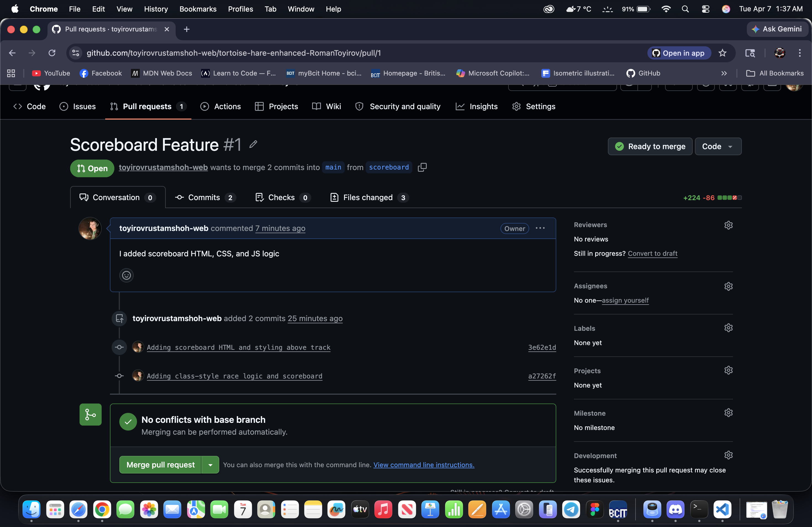

# Tortoise & Hare – Scoreboard Feature

## 1. What feature did you implement?
I implemented **Option A – Scoreboard**.  
The game now tracks total wins for the Tortoise and the Hare.  
The scoreboard appears above the track and updates automatically whenever a race finishes.

## 2. What was the most difficult bug or issue?
The most difficult issue was getting the JavaScript file to load correctly.  
At first, the game didn’t run because the script tag was not placed at the bottom of the HTML file, so the DOM elements didn’t exist when the JS tried to access them.  
Moving the script tag fixed the issue. I used Claude Code Review to find where I did mistakes. And also, I spent like 2-3 hrs to fix the issues and to learn new things. Additionally, I learnt new things to try on my JS from MDN Web Doc website. At the end, everything is working fine!!! Thank you for spending your time to review all my stuff, I really appreciate it! 

## 3. My 3 best commit messages
- `Adding scoreboard HTML and styling above track`
- `Added class-style race logic and scoreboard`
- `Adding base race logic and link script file`

## 4. Screenshot of Pull Request

